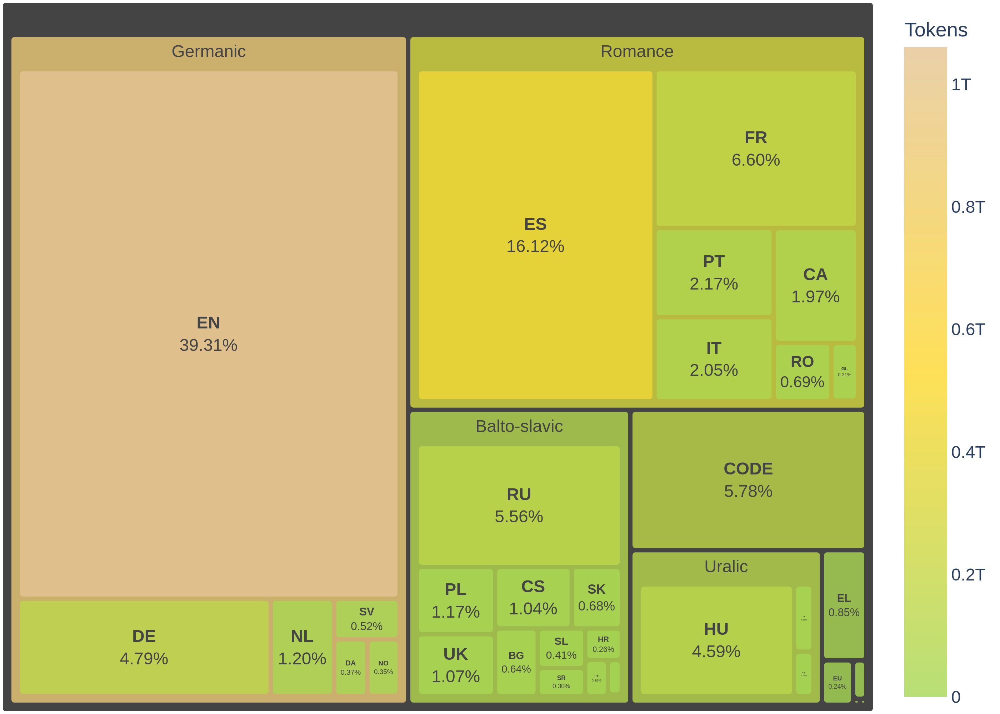

# Salamandra Model Card

This repository contains the model described in [Salamandra Technical Report](https://huggingface.co/papers/2502.08489).

Salamandra is a highly multilingual model pre-trained from scratch that comes in three different 
sizes — 2B, 7B and 40B parameters — with their respective base and instruction-tuned variants. 
This model card corresponds to the 2B base version.

To visit the model cards of other Salamandra versions, please refer to the [Model Index](#model-index).

The entire Salamandra family is released under a permissive [Apache 2.0 license](https://www.apache.org/licenses/LICENSE-2.0).
Along with the open weights, all training scripts and configuration files are made publicly available in [this GitHub repository](https://github.com/langtech-bsc/salamandra).

---

## Model Details

### Description

Transformer-based decoder-only language model that has been pre-trained from scratch on 12.875 trillion tokens of highly curated data.
The pre-training corpus contains text in 35 European languages and code.

### Hyperparameters

The full list of hyperparameters for each model can be found [here](https://github.com/langtech-bsc/salamandra/blob/main/configs/bsc_2b.yaml).

### Architecture

|                         |               |
|-------------------------|:--------------|
| Total Parameters        | 2,253,490,176 |
| Embedding Parameters    | 524,288,000   |
| Layers                  | 24            |
| Hidden size             | 2,048         |
| Attention heads         | 16            |
| Context length          | 8,192         |
| Vocabulary size         | 256,000       |
| Precision               | bfloat16      |
| Embedding type          | RoPE          |
| Activation Function     | SwiGLU        |
| Layer normalization     | RMS Norm      |
| Flash attention         | ✅            |
| Grouped Query Attention | ❌            |
| Num. query groups       | N/A           |

---

## Intended Use

### Direct Use

The models are intended for both research and commercial use in any of the languages included in the training data. 
The base models are intended either for language generation or to be further fine-tuned for specific use-cases. 
The instruction-tuned variants can be used as general-purpose assistants, as long as the user is fully aware of the model’s limitations.

### Out-of-scope Use

The model is not intended for malicious activities, such as harming others or violating human rights. 
Any downstream application must comply with current laws and regulations. 
Irresponsible usage in production environments without proper risk assessment and mitigation is also discouraged. 

---

## Hardware and Software

### Training Framework

Pre-training was conducted using NVIDIA’s [NeMo Framework](https://docs.nvidia.com/nemo-framework/index.html), 
which leverages PyTorch Lightning for efficient model training in highly distributed settings.

The instruction-tuned versions were produced with [FastChat](https://github.com/lm-sys/FastChat).

### Compute Infrastructure

All models were trained on [MareNostrum 5](https://www.bsc.es/ca/marenostrum/marenostrum-5), a pre-exascale EuroHPC supercomputer hosted and
operated by Barcelona Supercomputing Center.

The accelerated partition is composed of 1,120 nodes with the following specifications:
- 4x Nvidia Hopper GPUs with 64GB HBM2 memory
- 2x Intel Sapphire Rapids 8460Y+ at 2.3Ghz and 32c each (64 cores)
- 4x NDR200 (BW per node 800Gb/s)
- 512 GB of Main memory (DDR5)
- 460GB on NVMe storage

|Model|Nodes|GPUs|
|:---:|:---:|:---:|
|2B|64|256|
|7B|128|512|
|40B|256 / 512|1,024 / 2,048|

---

## How to use
This section offers examples of how to perform inference using various methods.

### Inference
You'll find different techniques for running inference, including Huggingface's Text Generation Pipeline, multi-GPU configurations, and vLLM for scalable and efficient generation. 

#### Inference with Huggingface's Text Generation Pipeline
The Huggingface Text Generation Pipeline provides a straightforward way to run inference using the Salamandra-2b model.

```bash
pip install transformers torch accelerate sentencepiece protobuf
```
<details>
<summary>Show code</summary>

```python
from transformers import pipeline, set_seed

model_id = "BSC-LT/salamandra-2b"

# Sample prompts
prompts = [
    "Todo el mundo sabe que vivir en Barcelona es",
    "¿Pueblo o ciudad? Una ventaja de vivir en la ciudad es que hay muchas oportunidades de ocio y empleo, así como una gran diversidad de comercios para todos los gustos. Sin embargo, las ciudades suelen ser ",
    "Llegir ens proporciona",
    "What I find more fascinating about languages is that",
    "La vie peut être",
    "The future of AI is",
]

# Create the pipeline
generator = pipeline("text-generation", model_id, device_map="auto")
generation_args = {
  "temperature": 0.1,
  "top_p": 0.95,
  "max_new_tokens": 25,
  "repetition_penalty": 1.2,
  "do_sample": True
}

# Fix the seed
set_seed(1)
# Generate texts
outputs = generator(prompts, **generation_args)
# Print outputs
for output in outputs:
  print(output[0]["generated_text"])

```
</details>

#### Inference with single / multi GPU
This section provides a simple example of how to run inference using Huggingface's AutoModel class.

```bash
pip install transformers torch accelerate sentencepiece protobuf
```

<details>
<summary>Show code</summary>

```python
from transformers import AutoTokenizer, AutoModelForCausalLM
import torch

model_id = "BSC-LT/salamandra-2b"

# Input text
text = "El mercat del barri és"

# Load the tokenizer
tokenizer = AutoTokenizer.from_pretrained(model_id)
# Load the model
model = AutoModelForCausalLM.from_pretrained(
  model_id,
  device_map="auto",
  torch_dtype=torch.bfloat16
)

generation_args = {
  "temperature": 0.1,
  "top_p": 0.95,
  "max_new_tokens": 25,
  "repetition_penalty": 1.2,
  "do_sample": True
}

inputs = tokenizer(text, return_tensors="pt")
# Generate texts
output = model.generate(input_ids=inputs["input_ids"].to(model.device), attention_mask=inputs["attention_mask"], **generation_args)
# Print outputs
print(tokenizer.decode(output[0], skip_special_tokens=True))
```

</details>

#### Inference with vLLM
vLLM is an efficient library for inference that enables faster and more scalable text generation.

```bash
pip install vllm
```

<details>
<summary>Show code</summary>

```python
from vllm import LLM, SamplingParams

model_id = "BSC-LT/salamandra-2b"

# Sample prompts
prompts = [
    "Todo el mundo sabe que vivir en Barcelona es",
    "¿Pueblo o ciudad? Una ventaja de vivir en la ciudad es que hay muchas oportunidades de ocio y empleo, así como una gran diversidad de comercios para todos los gustos. Sin embargo, las ciudades suelen ser ",
    "Llegir ens proporciona",
    "What I find more fascinating about languages is that",
    "La vie peut être",
    "The future of AI is",
]
# Create a sampling params object
sampling_params = SamplingParams(
  temperature=0.1,
  top_p=0.95,
  seed=1,
  max_tokens=25,
  repetition_penalty=1.2)

# Create an LLM
llm = LLM(model=model_id)
# Generate texts
outputs = llm.generate(prompts, sampling_params)
# Print outputs
for output in outputs:
    prompt = output.prompt
    generated_text = output.outputs[0].text
    print(f"Prompt: {prompt!r}, Generated text: {generated_text!r}")
```

</details>

---

## Data

### Pretraining Data

The pre-training corpus comprises data from 35 European languages and 92 programming languages, with detailed data sources provided below. 
The initial three training epochs used 2.4 trillion tokens, obtained by manually adjusting data proportion to balance the representation 
and give more importance to Spain’s co-official (Spanish, Catalan, Galician, and Basque). This way, we downsampled code and English data to half, 
Spanish co-official languages were oversampled by 2x, and the remaining languages were kept in their original proportions.
During the following epochs, the Colossal OSCAR dataset was replaced with the FineWeb-Edu dataset. 
This adjustment resulted in a total of 2.68 trillion tokens, distributed as outlined below:



The pretraining corpus is predominantly composed of data from Colossal OSCAR, which contributes a significant 53.05% of the total tokens. 
Following this, Starcoder provides 13.67%, and FineWeb-Edu (350BT subset) adds 10.24%. The next largest sources are HPLT at 4.21% and French-PD at 3.59%. 
Other notable contributions include MaCoCu, Legal-ES, and EurLex, each contributing around 1.72% to 1.41%. 
These major sources collectively form the bulk of the corpus, ensuring a rich and diverse dataset for training the language model. 
The remaining 10% comes from smaller sources in various languages.

Feel free to click the expand button below to see the full list of sources.

<details>
<summary>Data Sources</summary>
  

| Dataset | Language | Source |
|---|---|---|
| Colossal OSCAR 1.0 | bg, ca, cs, cy, da, de, el, en, es, et, eu, fi, fr, ga, gl, hr, hu, it, lt, lv, mt, nl, nn, no, oc, pl, pt, ro, ru, sh, sk, sl, sr, sv, uk | Brack et al., 2024 |
| Aya Dataset (w/o Evaluation Suite) | eu, hr, nl, fi, ka, hu, lt, nn, ro, sk, lv, cy, bg, cs, en, fr, de, ga, mt, pl, ru, sl, sv, ca, da, et, gl, el, it, no, pt, sr, es, uk | Singh et al., 2024 |
| Wikimedia dumps | bg, ca, cs, da, de, el, en, es, et, eu, fi, fr, ga, gl, hr, hu, it, lt, lv, mt, nl, nn, no, pl, pt, ro, sh, sk, sl, sr, uk | [Link](https://dumps.wikimedia.org/) |
| OpenSubtitles v2016 | bg, ca, cs, da, de, el, en, es, et, eu, fi, fr, gl, hr, it, lt, lv, nl, no, pl, pt, ro, sk, sl, sr, sv, uk | Lison & Tiedemann, 2016 |
| EurLEX-Resources | bg, cs, da, de, el, en, es, et, fi, fr, ga, hr, hu, it, lt, lv, mt, nl, pl, pt, ro, sk, sl, sv | [Link](https://huggingface.co/datasets/joelniklaus/eurlex_resources) |
| MC4-Legal | bg, cs, da, de, el, en, es, et, fi, fr, ga, hu, it, lt, lv, mt, nl, pl, pt, ro, sk, sl, sv | [Link](https://huggingface.co/datasets/joelito/legal-mc4) |
| Parlamint | at, bg, cz, dk, ee, es, es-ga, fi, fr, gb, gr, hr, hu, it, lv, nl, no, pl, pt, rs, se, si | Erjavec et al., 2021 |
| MaCoCu | bg, ca, el, hr, mt, sl, sr, uk | Bañón et al., 2022 |
| CURLICAT | bg, hr, hu, pl, ro, sk, sl | Váradi et al., 2022 |
| Norwegian Colossal Corpus (NCC) | nn, no | Kummervold et al., 2021 |
| Academic Slovene KAS 2.0 | sl | Žagar et al., 2022 |
| BIGPATENT | en | Sharma et al., 2019 |
| Biomedical-ES | es | Internally generated biomedical dataset: Wikipedia LS, Pubmed, MeSpEn, patents, clinical cases, medical crawler |
| Brazilian Portuguese Web as Corpus (BrWaC) | pt | Wagner Filho et al., 2018 |
| Bulgarian National Corpus (BulNC) | bg | [Link](http://old.dcl.bas.bg/dataset/BulNC.7z) |
| CaBeRnet | fr | Popa-Fabre et al., 2020 |
| CATalog 1.0 | ca | Palomar-Giner et al., 2024 |
| CorpusNÓS | gl | de-Dios-Flores et al., 2024 |
| Croatian Web as Corpus 2.1 (hrWaC) | hr | Ljubešić & Klubička, 2014 |
| DaNewsroom | da | Varab & Schluter, 2020 |
| Danish GigaWord | da | Strømberg-Derczynski et al., 2021 |
| DK-CLARIN Reference Corpus of General Danish | da | [Link](https://korpus.dsl.dk/clarin/) |
| Estonian National Corpus 2021 (ENC) | et | Koppel & Kallas, 2022 |
| Estonian Reference Corpus (ERC) | et | [Link](https://www.cl.ut.ee/korpused/segakorpus/) |
| EusCrawl (w/o Wikipedia or NC-licenses) | eu | Artetxe et al., 2022 |
| FineWeb-Edu (350BT subset) | en | Penedo et al., 2024 |
| French Public Domain Books (French-PD) | fr | [Link](https://huggingface.co/datasets/PleIAs/French-PD-Books) |
| French Public Domain Newspapers (French-PD) | fr | [Link](https://huggingface.co/datasets/PleIAs/French-PD-Newspapers) |
| German Web as Corpus (DeWaC)  | de | [Link](https://docs.sslmit.unibo.it/doku.php?id=corpora:dewac) |
| Greek Legal Code (GLC) | el | Papaloukas et al., 2021 |
| Greek Web Corpus (GWC) | el | Outsios et al., 2018 |
| HPLT v1 - Spanish | es | de Gibert et al., 2024 |
| HPLT v1.1 - Spanish | es | de Gibert et al., 2024 |
| Irish Universal Dependencies (Ga-UD) | ga | [Link](https://universaldependencies.org/ga/index.html) |
| Italian Web as Corpus (ItWaC) | it | [Link](https://docs.sslmit.unibo.it/doku.php?id=corpora:itwac) |
| Korpus Malti | mt | Micallef et al., 2022 |
| Korpus slovenských právnych predpisov v1.9 (SK-Laws) | sk | [Link](https://www.juls.savba.sk/data/marcell/legal-sk-20220322-1.9.ver.xz) |
| Latxa Corpus v1.1  (GAITU) | eu | Etxaniz et al., 2024 [Link](https://huggingface.co/datasets/HiTZ/latxa-corpus-v1.1) |
| Laws and legal acts of Ukraine (UK-Laws) | uk | [Link](https://lang.org.ua/en/corpora/#anchor7) |
| Legal-ES | es | Internally generated legal dataset: BOE, BORME, Senado, Congreso, Spanish court orders, DOGC |
| MARCELL Romanian legislative subcorpus v2 | ro | [Link](https://elrc-share.eu/reposMARCELL%20Romanian%20legislative%20subcorpus%20v2itory/browse/marcell-romanian-legislative-subcorpus-v2/2da548428b9d11eb9c1a00155d026706ce94a6b59ffc4b0e9fb5cd9cebe6889e/) |
| Math AMPS | en | Hendrycks et al., 2021 |
| NKPJ National Corpus of Polish v1.2 (NKPJ) | pl | Lewandowska-Tomaszczyk et al., 2013 |
| Occitan Corpus (IEA-AALO) | oc | Provided by [IEA](https://www.institutestudisaranesi.cat/) |
| Open Legal Data - German court decisions and laws | de | Ostendorff et al., 2020 |
| ParlamentoPT | pt | Rodrigues et al., 2023 |
| peS2o | en | Soldaini & Lo, 2023 |
| PG-19 | en | Rae et al., 2019 |
| Pile of Law (selected subsets) | en | Henderson* et al., 2022 |
| Polish Parliamentary Corpus (PPC) | pl | Ogrodniczuk, 2018 |
| Proof Pile  | en | [Link](https://huggingface.co/datasets/hoskinson-center/proof-pile) |
| RedPajama-Data T1 (StackExchange subset) | en | Computer, 2023 |
| Scientific-ES | es | Internally generated scientific dataset: Dialnet, Scielo, CSIC, TDX, BSC, UCM |
| SK Court Decisions v2.0 (OD-Justice) | sk | [Link](https://www.juls.savba.sk/data/od-justice/od-justice-2.0.ver.xz) |
| Slovene Web as Corpus (slWaC) | sl | Erjavec et al., 2015 |
| SoNaR Corpus NC 1.2 | nl | [Link](https://taalmaterialen.ivdnt.org/download/tstc-sonar-corpus/) |
| Spanish Legal Domain Corpora (Spanish-Legal) | es | Gutiérrez-Fandiño et al., 2021 |
| SrpKorSubset: news, legal, academic, conversation, lit- erary (SrpKor) | sr | [Link](http://www.korpus.matf.bg.ac.rs/) |
| Starcoder | code | Li et al., 2023 |
| State-related content from the Latvian Web (State-Latvian-Web) | lv | [Link](https://catalog.elra.info/en-us/repository/browse/ELRA-W0169/) |
| SYN v9: large corpus of written Czech | cs | Křen et al., 2021 |
| Tagesschau Archive Article | de | [Link](https://huggingface.co/datasets/bjoernp/tagesschau-2018-2023) |
| The Danish Parliament Corpus 2009 - 2017, v1 | da | Hansen, 2018 |
| The Gaois bilingual corpus of English-Irish legislation (Ga-Legislation) | ga | [Link](https://portulanclarin.net/repository/browse/the-gaois-bilingual-corpus-of-english-irish-legislation-processed/daeac17c9e3511ea9b7f02420a000407b83de243dc0b469aab41084386c5b80f/) |
| The Pile (PhilPapers) | en | Gao et al., 2021 |
| The Swedish Culturomics Gigaword Corpus (Swedish- Gigaword) | sv | Rødven-Eide, 2016 |
| Welsh-GOV | cy | Crawling from [Link](https://www.llyw.cymru) |
| Yle Finnish News Archive (Yle-News) | fi | [Link](http://urn.fi/urn:nbn:fi:lb-2021050401) |

To consult the data summary document with the respective licences, please send an e-mail to ipr@bsc.es. 

<details>
<summary>References</summary>

- Abadji, J., Suárez, P. J. O., Romary, L., & Sagot, B. (2021). Ungoliant: An optimized pipeline for the generation of a very large-scale multilingual web corpus (H. Lüngen, M. Kupietz, P. Bański, A. Barbaresi, S. Clematide, & I. Pisetta, Eds.; pp. 1–9). Leibniz-Institut für Deutsche Sprache. [Link](https://doi.org/10.14618/ids-pub-10468)
- Artetxe, M., Aldabe, I., Agerri, R., Perez-de-Viñaspre, O., & Soroa, A. (2022). Does Corpus Quality Really Matter for Low-Resource Languages?
- Bañón, M., Esplà-Gomis, M., Forcada, M. L., García-Romero, C., Kuzman, T., Ljubešić, N., van Noord, R., Sempere, L. P., Ramírez-Sánchez, G., Rupnik, P., Suchomel, V., Toral, A., van der Werff, T., & Zaragoza, J. (2022). MaCoCu: Massive collection and curation of monolingual and bilingual data: Focus on under-resourced languages. Proceedings of the 23rd Annual Conference of the European Association for Machine Translation, 303–304. [Link](https://aclanthology.org/2022.eamt-1.41)
- Brack, M., Ostendorff, M., Suarez, P. O., Saiz, J. J., Castilla, I. L., Palomar-Giner, J., Shvets, A., Schramowski, P., Rehm, G., Villegas, M., & Kersting, K. (2024). Community OSCAR: A Community Effort for Multilingual Web Data. [Link](https://occiglot.eu/papers/Community_Oscar.pdf)
- Computer, T. (2023). RedPajama: An Open Source Recipe to Reproduce LLaMA training dataset [Computer software]. [Link](https://github.com/togethercomputer/RedPajama-Data)
- de Gibert, O., Nail, G., Arefyev, N., Bañón, M., van der Linde, J., Ji, S., Zaragoza-Bernabeu, J., Aulamo, M., Ramírez-Sánchez, G., Kutuzov, A., Pyysalo, S., Oepen, S., & Tiedemann, J. (2024). A New Massive Multilingual Dataset for High-Performance Language Technologies (arXiv:2403.14009). arXiv. [Link](http://arxiv.org/abs/2403.14009)
- Dodge, J., Sap, M., Marasović, A., Agnew, W., Ilharco, G., Groeneveld, D., Mitchell, M., & Gardner, M. (2021). Documenting Large Webtext Corpora: A Case Study on the Colossal Clean Crawled Corpus. In M.-F. Moens, X. Huang, L. Specia, & S. W. Yih (Eds.), Proceedings of the 2021 Conference on Empirical Methods in Natural Language Processing (pp. 1286–1305). Association for Computational Linguistics. [Link](https://doi.org/10.18653/v1/2021.emnlp-main.98)
- Erjavec, T., Ljubešić, N., & Logar, N. (2015). The slWaC corpus of the Slovene web. Informatica (Slovenia), 39, 35–42.
- Erjavec, T., Ogrodniczuk, M., Osenova, P., Ljubešić, N., Simov, K., Grigorova, V., Rudolf, M., Pančur, A., Kopp, M., Barkarson, S., Steingrímsson, S. hór, van der Pol, H., Depoorter, G., de Does, J., Jongejan, B., Haltrup Hansen, D., Navarretta, C., Calzada Pérez, M., de Macedo, L. D., … Rayson, P. (2021). Linguistically annotated multilingual comparable corpora of parliamentary debates ParlaMint.ana 2.1. [Link](http://hdl.handle.net/11356/1431)
- Etxaniz, J., Sainz, O., Perez, N., Aldabe, I., Rigau, G., Agirre, E., Ormazabal, A., Artetxe, M., & Soroa, A. (2024). Latxa: An Open Language Model and Evaluation Suite for Basque. [Link] (https://arxiv.org/abs/2403.20266)
- Gao, L., Biderman, S., Black, S., Golding, L., Hoppe, T., Foster, C., Phang, J., He, H., Thite, A., Nabeshima, N., Presser, S., & Leahy, C. (2021). The Pile: An 800GB Dataset of Diverse Text for Language Modeling. CoRR, abs/2101.00027. [Link](https://arxiv.org/abs/2101.00027)
- Gutiérrez-Fandiño, A., Armengol-Estapé, J., Gonzalez-Agirre, A., & Villegas, M. (2021). Spanish Legalese Language Model and Corpora.
- Hansen, D. H. (2018). The Danish Parliament Corpus 2009—2017, v1. [Link](http://hdl.handle.net/20.500.12115/8)
- Henderson*, P., Krass*, M. S., Zheng, L., Guha, N., Manning, C. D., Jurafsky, D., & Ho, D. E. (2022). Pile of Law: Learning Responsible Data Filtering from the Law and a 256GB Open-Source Legal Dataset. arXiv. [Link](https://arxiv.org/abs/2207.00220)
- Hendrycks, D., Burns, C., Kadavath, S., Arora, A., Basart, S., Tang, E., Song, D., & Steinhardt, J. (2021). Measuring Mathematical Problem Solving With the MATH Dataset. NeurIPS.
- Jansen, T., Tong, Y., Zevallos, V., & Suarez, P. O. (2022). Perplexed by Quality: A Perplexity-based Method for Adult and Harmful Content Detection in Multilingual Heterogeneous Web Data.
- Koppel, K., & Kallas, J. (2022). Eesti keele ühendkorpuste sari 2013–2021: Mahukaim eestikeelsete digitekstide kogu. Eesti Rakenduslingvistika Ühingu Aastaraamat Estonian Papers in Applied Linguistics, 18, 207–228. [Link](https://doi.org/10.5128/erya18.12)
- Křen, M., Cvrček, V., Henyš, J., Hnátková, M., Jelínek, T., Kocek, J., Kováříková, D., Křivan, J., Milička, J., Petkevič, V., Procházka, P., Skoumalová, H., Šindlerová, J., & Škrabal, M. (2021). SYN v9: Large corpus of written Czech. [Link](http://hdl.handle.net/11234/1-4635)
- Kreutzer, J., Caswell, I., Wang, L., Wahab, A., van Esch, D., Ulzii-Orshikh, N., Tapo, A., Subramani, N., Sokolov, A., Sikasote, C., Setyawan, M., Sarin, S., Samb, S., Sagot, B., Rivera, C., Rios, A., Papadimitriou, I., Osei, S., Suarez, P. O., … Adeyemi, M. (2022). Quality at a Glance: An Audit of Web-Crawled Multilingual Datasets. Transactions of the Association for Computational Linguistics, 10, 50–72. [Link](https://doi.org/10.1162/tacl_a_00447)
- Kummervold, P. E., De la Rosa, J., Wetjen, F., & Brygfjeld, S. A. (2021). Operationalizing a National Digital Library: The Case for a Norwegian Transformer Model. In S. Dobnik & L. Øvrelid (Eds.), Proceedings of the 23rd Nordic Conference on Computational Linguistics (NoDaLiDa) (pp. 20–29). Linköping University Electronic Press, Sweden. [Link](https://aclanthology.org/2021.nodalida-main.3)
- Lewandowska-Tomaszczyk, B., Górski, R., Łaziński, M., & Przepiórkowski, A. (2013). The National Corpus of Polish (NKJP). Language use and data analysis. 309–319.
- Li, R., Allal, L. B., Zi, Y., Muennighoff, N., Kocetkov, D., Mou, C., Marone, M., Akiki, C., Li, J., Chim, J., Liu, Q., Zheltonozhskii, E., Zhuo, T. Y., Wang, T., Dehaene, O., Davaadorj, M., Lamy-Poirier, J., Monteiro, J., Shliazhko, O., … Vries, H. de. (2023). StarCoder: May the source be with you!
- Lison, P., & Tiedemann, J. (2016). OpenSubtitles2016: Extracting Large Parallel Corpora from Movie and TV Subtitles. In N. Calzolari, K. Choukri, T. Declerck, S. Goggi, M. Grobelnik, B. Maegaard, J. Mariani, H. Mazo, A. Moreno, J. Odijk, & S. Piperidis (Eds.), Proceedings of the Tenth International Conference on Language Resources and Evaluation (LREC’16) (pp. 923–929). European Language Resources Association (ELRA). [Link](https://aclanthology.org/L16-1147)
- Ljubešić, N., & Klubička, F. (2014). Bs,hr,srWaC - Web Corpora of Bosnian, Croatian and Serbian. In F. Bildhauer & R. Schäfer (Eds.), Proceedings of the 9th Web as Corpus Workshop (WaC-9) (pp. 29–35). Association for Computational Linguistics. [Link](https://doi.org/10.3115/v1/W14-0405)
- Micallef, K., Gatt, A., Tanti, M., van der Plas, L., & Borg, C. (2022). Pre-training Data Quality and Quantity for a Low-Resource Language: New Corpus and BERT Models for Maltese. Proceedings of the Third Workshop on Deep Learning for Low-Resource Natural Language Processing, 90–101. [Link](https://doi.org/10.18653/v1/2022.deeplo-1.10)
- Ogrodniczuk, M. (2018). Polish Parliamentary Corpus. [Link](https://api.semanticscholar.org/CorpusID:235134113)
- Ostendorff, M., Blume, T., & Ostendorff, S. (2020). Towards an Open Platform for Legal Information. Proceedings of the ACM/IEEE Joint Conference on Digital Libraries in 2020, 385–388. [Link](https://doi.org/10.1145/3383583.3398616)
- Ostendorff, M., Suarez, P. O., Lage, L. F., & Rehm, G. (2024). LLM-Datasets: An Open Framework for Pretraining Datasets of Large Language Models. First Conference on Language Modeling. [Link](https://openreview.net/forum?id=5RdIMlGLXL)
- Outsios, S., Skianis, K., Meladianos, P., Xypolopoulos, C., & Vazirgiannis, M. (2018). Word Embeddings from Large-Scale Greek Web content. arXiv Preprint arXiv:1810.06694.
- Palomar-Giner, J., Saiz, J. J., Espuña, F., Mina, M., Da Dalt, S., Llop, J., Ostendorff, M., Ortiz Suarez, P., Rehm, G., Gonzalez-Agirre, A., & Villegas, M. (2024). A CURATEd CATalog: Rethinking the Extraction of Pretraining Corpora for Mid-Resourced Languages. In N. Calzolari, M.-Y. Kan, V. Hoste, A. Lenci, S. Sakti, & N. Xue (Eds.), Proceedings of the 2024 Joint International Conference on Computational Linguistics, Language Resources and Evaluation (LREC-COLING 2024) (pp. 335–349). ELRA and ICCL. [Link](https://aclanthology.org/2024.lrec-main.31)
- Papaloukas, C., Chalkidis, I., Athinaios, K., Pantazi, D.-A., & Koubarakis, M. (2021). Multi-granular Legal Topic Classification on Greek Legislation. Proceedings of the Natural Legal Language Processing Workshop 2021, 63–75. [Link](https://doi.org/10.48550/arXiv.2109.15298)
- Popa-Fabre, M., Ortiz Suárez, P. J., Sagot, B., & de la Clergerie, É. (2020). French Contextualized Word-Embeddings with a sip of CaBeRnet: A New French Balanced Reference Corpus. Proceedings of the 8th Workshop on Challenges in the Management of Large Corpora, 15–23. [Link](https://aclanthology.org/2020.cmlc-1.3)
- Rae, J. W., Potapenko, A., Jayakumar, S. M., Hillier, C., & Lillicrap, T. P. (2019). Compressive Transformers for Long-Range Sequence Modelling. arXiv Preprint. [Link](https://arxiv.org/abs/1911.05507)
- Rodrigues, J., Gomes, L., Silva, J., Branco, A., Santos, R., Cardoso, H. L., & Osório, T. (2023). Advancing Neural Encoding of Portuguese with Transformer Albertina PT-\*.
- Rødven-Eide, S. (2016). The Swedish Culturomics Gigaword CorpusThe Swedish Culturomics Gigaword Corpus [Dataset]. Språkbanken Text. [Link](https://doi.org/10.23695/3WMV-1Z09)
- Sharma, E., Li, C., & Wang, L. (2019). BIGPATENT: A Large-Scale Dataset for Abstractive and Coherent Summarization. CoRR, abs/1906.03741. [Link](http://arxiv.org/abs/1906.03741)
- Soldaini, L., & Lo, K. (2023). peS2o (Pretraining Efficiently on S2ORC) Dataset. Allen Institute for AI.
- Strømberg-Derczynski, L., Ciosici, M., Baglini, R., Christiansen, M. H., Dalsgaard, J. A., Fusaroli, R., Henrichsen, P. J., Hvingelby, R., Kirkedal, A., Kjeldsen, A. S., Ladefoged, C., Nielsen, F. Å., Madsen, J., Petersen, M. L., Rystrøm, J. H., & Varab, D. (2021). The Danish Gigaword Corpus. Proceedings of the 23rd Nordic Conference on Computational Linguistics (NoDaLiDa), 413–421. [Link](https://aclanthology.org/2021.nodalida-main.46)
- Subramani, N., Luccioni, S., Dodge, J., & Mitchell, M. (2023). Detecting Personal Information in Training Corpora: An Analysis. 208–220. [Link](https://doi.org/10.18653/v1/2023.trustnlp-1.18)
- Varab, D., & Schluter, N. (2020). DaNewsroom: A Large-scale Danish Summarisation Dataset. Proceedings of The 12th Language Resources and Evaluation Conference, 6731–6739. [Link](https://www.aclweb.org/anthology/2020.lrec-1.831)
- Váradi, T., Nyéki, B., Koeva, S., Tadić, M., Štefanec, V., Ogrodniczuk, M., Nitoń, B., Pezik, P., Barbu Mititelu, V., Irimia, E., Mitrofan, M., Tufi\textcommabelows, D., Garabík, R., Krek, S., & Repar, A. (2022). Introducing the CURLICAT Corpora: Seven-language Domain Specific Annotated Corpora from Curated Sources. In N. Calzolari, F. Béchet, P. Blache, K. Choukri, C. Cieri, T. Declerck, S. Goggi, H. Isahara, B. Maegaard, J. Mariani, H. Mazo, J. Odijk, & S. Piperidis (Eds.), Proceedings of the Thirteenth Language Resources and Evaluation Conference (pp. 100–108). European Language Resources Association. [Link](https://aclanthology.org/2022.lrec-1.11)
- Wagner Filho, J. A., Wilkens, R., Idiart, M., & Villavicencio, A. (2018). The brwac corpus: A new open resource for brazilian portuguese. Proceedings of the Eleventh International Conference on Language Resources and Evaluation (LREC 2018).
- Žagar, A., Kavaš, M., Robnik-Šikonja, M., Erjavec, T., Fišer, D., Ljubešić, N., Ferme, M., Borovič, M., Boškovič, B., Ojsteršek, M., & Hrovat, G. (2022). Corpus of academic Slovene KAS 2.0. [Link](http://hdl.handle.net/11356/1448)
- Alicia Parrish, Angelica Chen, Nikita Nangia, Vishakh Padmakumar, Jason Phang, Jana Thompson, Phu Mon Htut, and Samuel Bowman. 2022. BBQ: A hand-built bias benchmark for question answering. In Findings of the Association for Computational Linguistics: ACL 2022, pages 2086–2105, Dublin, Ireland. Association for Computational Linguistics.
- Emily Sheng, Kai-Wei Chang, Premkumar Natarajan, and Nanyun Peng. 2019. The Woman Worked as a Babysitter: On Biases in Language Generation. In Proceedings of the 2019 Conference on Empirical Methods in Natural Language Processing and the 9th International Joint Conference on Natural Language Processing (EMNLP-IJCNLP), pages 3407–3412, Hong Kong, China. Association for Computational Linguistics.
- Clark, P., Cowhey, I., Etzioni, O., Khot, T., Sabharwal, A., Schoenick, C., & Tafjord, O. (2018). Think you have Solved Question Answering? Try ARC, the AI2 Reasoning Challenge. arXiv:1803. 05457v1.
- Richard Socher, Alex Perelygin, Jean Wu, Jason Chuang, Christopher D. Manning, Andrew Ng, and Christopher Potts. 2013. Recursive Deep Models for Semantic Compositionality Over a Sentiment Treebank. In Proceedings of the 2013 Conference on Empirical Methods in Natural Language Processing, pages 1631–1642, Seattle, Washington, USA. Association for Computational Linguistics.
- Penedo, G., Kydlíček, H., allal, L. B., Lozhkov, A., Mitchell, M., Raffel, C., Von Werra, L., & Wolf, T. (2024). The FineWeb Datasets: Decanting the Web for the Finest Text Data at Scale (arXiv:2406.17557). arXiv. http://arxiv.org/abs/2406.17557
- Singh, S., Vargus, F., Dsouza, D., Karlsson, B. F., Mahendiran, A., Ko, W.-Y., Shandilya, H., Patel, J., Mataciunas, D., OMahony, L., Zhang, M., Hettiarachchi, R., Wilson, J., Machado, M., Moura, L. S., Krzemiński, D., Fadaei, H., Ergün, I., Okoh, I., … Hooker, S. (2024). Aya Dataset: An Open-Access Collection for Multilingual Instruction Tuning (arXiv:2402.06619). arXiv. http://arxiv.org/abs/2402.06619

</details>

</details>

The model was trained on 3 pre-training epochs with 2.4T tokens per epoch, 2 additional pre-training epochs in which the English part 
of the Colossal OSCAR dataset was replaced with FineWeb-Edu (350BT subset), resulting in 2.68T tokens per epoch; 
and 1 final epoch of 0.315T higher quality tokens, meaning that the total number of tokens seen during pre-training is approximately 12.875 trillion tokens.

We provide an extense Datasheet section following the best practices defined by [(Gebru et al., 2021)](https://arxiv.org/pdf/1803.09010).

<details>
<summary>Datasheet</summary>

#### Motivation

**For what purpose was the dataset created? Was there a specific task in mind? Was there a specific gap that needed to be filled? Please provide a description.**

The purpose of creating this dataset is to pre-train the Salamandra family of multilingual models with high performance in a large number of European languages (35) 
and programming languages (92). We also want to represent the co-official languages of Spain: Spanish, Catalan, Galician and Basque. For this reason, we oversample 
these languages by a factor of 2.

There is a great lack of massive multilingual data, especially in minority languages (Ostendorff & Rehm, 2023), so part of our efforts in the creation of 
this pre-training dataset have resulted in the contribution to large projects such as the Community OSCAR (Brack et al., 2024), which includes 151 languages 
and 40T words, or CATalog (Palomar-Giner et al., 2024), the largest open dataset in Catalan in the world.

**Who created the dataset (e.g., which team, research group) and on behalf of which entity (e.g., company, institution, organization)?**

The dataset has been created by the Language Technologies unit (LangTech) of the Barcelona Supercomputing Center - Centro Nacional de Supercomputación (BSC-CNS), 
which aims to advance the field of natural language processing through cutting-edge research and development and the use of HPC. In particular, it was created by 
the unit's data team, the main contributors being José Javier Saiz, Ferran Espuña and Jorge Palomar.

However, the creation of the dataset would not have been possible without the collaboration of a large number of collaborators, partners and public institutions, 
which can be found in detail in the acknowledgements.

**Who funded the creation of the dataset? If there is an associated grant, please provide the name of the grantor and the grant name and number.**

This work has been promoted and financed by the Government of Catalonia through the [Aina project](https://projecteaina.cat/).

This work is funded by the _Ministerio para la Transformación Digital y de la Función Pública_ - Funded by EU – NextGenerationEU 
within the framework of [ILENIA Project](https://proyectoilenia.es/) with reference 2022/TL22/00215337.

#### Composition

**What do the instances that comprise the dataset represent (e.g., documents, photos, people, countries)? Are there multiple types of instances (e.g., movies, users, and ratings; people and interactions between them; nodes and edges)? Please provide a description.**

The dataset consists entirely of text documents in various languages. Specifically, data was mainly sourced from the following databases and 
repositories:
- **Common Crawl:** Repository that holds website data and is run by the Common Crawl non-profit organization. It is updated monthly and is
  distributed under the CC0 1.0 public domain license.
- **GitHub:** Community platform that allows developers to create, store, manage, and share their code. Repositories are crawled and then
  distributed with their original licenses, which may vary from permissive to non-commercial licenses.
- **Wikimedia:** Database that holds the collection databases managed by the Wikimedia Foundation, including Wikipedia, Wikibooks, Wikinews,
  Wikiquote, Wikisource, and Wikivoyage. It is updated monthly and is distributed under Creative Commons Attribution-ShareAlike License 4.0.
- **EurLex:** Repository that holds the collection of legal documents from the European Union, available in all of the EU’s 24 official
  languages and run by the Publications Office of the European Union. It is updated daily and is distributed under the Creative Commons
  Attribution 4.0 International license.
- **Other repositories:** Specific repositories were crawled under permission for domain-specific corpora, which include academic, legal,
  and newspaper repositories.

We provide a complete list of dataset sources at the end of this section.

**How many instances are there in total (of each type, if appropriate)?**

The dataset contains a diverse range of instances across multiple languages, with notable adjustments for certain languages. English 
represents the largest portion, accounting for 39.31% of the total data. Spanish was upsampled by a factor of 2, bringing its share to 16.12%,
while Catalan (1.97%), Basque (0.24%), and Galician (0.31%) were also upsampled by 2. On the other hand, code-related data was downsampled 
by half, making up 5.78% of the total. Other prominent languages include French (6.6%), Russian (5.56%), German (4.79%), and Hungarian 
(4.59%), with several additional languages contributing between 1% and 2%, and smaller portions represented by a variety of others.

**Does the dataset contain all possible instances or is it a sample (not necessarily random) of instances from a larger set? If the dataset is a sample, then what is the larger set? Is the sample representative of the larger set (e.g., geographic coverage)? If so, please describe how this representativeness was validated/verified. If it is not representative of the larger set, please describe why not (e.g., to cover a more diverse range of instances, because instances were withheld or unavailable).**

The dataset is a sample from multiple sources, with different weights based on the primary language of the content: Spanish, Catalan, 
Basque, and Galician content was upsampled by a factor of two, while programming languages were downsampled by a factor of half. Other 
sources were sampled in proportion to their occurrence.

**What data does each instance consist of? “Raw” data (e.g., unprocessed text or images) or features? In either case, please provide a description.**

Each instance consists of a text document processed for deduplication, language identification, and source-specific filtering. Some documents required 
optical character recognition (OCR) to extract text from non-text formats such as PDFs.

**Is there a label or target associated with each instance? If so, please provide a description.**

Each instance is labelled with a unique identifier, the primary language of the content, and the URL for web-sourced instances. Additional labels were 
automatically assigned to detect specific types of content -harmful or toxic content- and to assign preliminary indicators of undesired qualities -very 
short documents, high density of symbols, etc.- which were used for filtering instances.

**Is any information missing from individual instances? If so, please provide a description, explaining why this information is missing (e.g., because it was unavailable). This does not include intentionally removed information, but might include, e.g., redacted text.**

No significant information is missing from the instances.

**Are relationships between individual instances made explicit (e.g., users’ movie ratings, social network links)? If so, please describe how these relationships are made explicit.**

Instances are related through shared metadata, such as source and language identifiers.

**Are there recommended data splits (e.g., training, development/validation, testing)? If so, please provide a description of these splits, explaining the rationale behind them.**

The dataset is randomly divided into training, validation and test sets, where the validation and test sets are each 1% of the total corpus.

**Are there any errors, sources of noise, or redundancies in the dataset? If so, please provide a description.**

Despite removing duplicated instances within each source, redundancy remains at the paragraph and sentence levels, particularly in web-sourced 
instances where search engine optimization techniques and templates contribute to repeated textual patterns. Some instances may be also duplicated 
across sources due to format variations.

**Is the dataset self-contained, or does it link to or otherwise rely on external resources (e.g., websites, tweets, other datasets)? If it links to or relies on external resources, a) are there guarantees that they will exist, and remain constant, over time; b) are there official archival versions of the complete dataset (i.e., including the external resources as they existed at the time the dataset was created); c) are there any restrictions (e.g., licenses, fees) associated with any of the external resources that might apply to a dataset consumer? Please provide descriptions of all external resources and any restrictions associated with them, as well as links or other access points, as appropriate.**

The dataset is self-contained and does not rely on external resources.

**Does the dataset contain data that might be considered confidential (e.g., data that is protected by legal privilege or by doctor–patient confidentiality, data that includes the content of individuals’ non-public communications)? If so, please provide a description.**

The dataset does not contain confidential data.

**Does the dataset contain data that, if viewed directly, might be offensive, insulting, threatening, or might otherwise cause anxiety? If so, please describe why. If the dataset does not relate to people, you may skip the remaining questions in this section.**

The dataset includes web-crawled content, which may overrepresent pornographic material across languages (Kreutzer et al., 2022). Although 
pre-processing techniques were applied to mitigate offensive content, the heterogeneity and scale of web-sourced data make exhaustive 
filtering challenging, which makes it next to impossible to identify all adult content without falling into excessive filtering, which may 
negatively influence certain demographic groups (Dodge et al., 2021).

**Does the dataset identify any subpopulations (e.g., by age, gender)? If so, please describe how these subpopulations are identified and provide a description of their respective distributions within the dataset.**

The dataset does not explicitly identify any subpopulations.

**Is it possible to identify individuals (i.e., one or more natural persons), either directly or indirectly (i.e., in combination with other data) from the dataset? If so, please describe how.**

Web-sourced instances in the dataset may contain personally identifiable information (PII) that is publicly available on the Web, such as names, 
IP addresses, email addresses, and phone numbers. While it would be possible to indirectly identify individuals through the combination of multiple 
data points, the nature and scale of web data makes it difficult to parse such information. In any case, efforts are made to filter or anonymize 
sensitive data (Mina et al., 2024), but some identifiable information may remain in the dataset.

**Does the dataset contain data that might be considered sensitive in any way? If so, please provide a description.**

Given that the dataset includes web-sourced content and other publicly available documents, instances may inadvertently reveal financial 
information, health-related details, or forms of government identification, such as social security numbers (Subramani et al., 2023), 
especially if the content originates from less-regulated sources or user-generated platforms. 

#### Collection Process

**How was the data collected?**

This dataset is constituted by combining several sources, whose acquisition methods can be classified into three groups:
- Web-sourced datasets with some preprocessing available under permissive license.
- Domain-specific or language-specific raw crawls.
- Manually curated data obtained through collaborators, data providers (by means of legal assignment agreements) or open source projects (e.g. CATalog).

**What mechanisms or procedures were used to collect the data? How were these mechanisms or procedures validated?**

The data collection process was carried out using three different mechanisms, each corresponding to one of the groups defined in the previous answer. The specific methods used and their respective validation procedures are outlined below:
- Open Direct Download: Data were obtained directly from publicly accessible sources, such as websites or repositories that provide open data downloads. We validate the data with a data integrity check, which ensures that the downloaded files are complete, uncorrupted and in the expected format and structure.
- Ad hoc scrapers or crawlers: Custom web scraping scripts or crawlers were used to extract data from various online sources where direct downloads were not available. These scripts navigate web pages, extract relevant data and store it in a structured format. We validate this method with software unit tests to evaluate the functionality of individual components of the scraping programs, checking for errors or unexpected behaviour. In addition, data integrity tests were performed to verify that the collected data remained complete throughout the extraction and storage process.
- Direct download via FTP, SFTP, API or S3: Some datasets were acquired using secure transfer protocols such as FTP (File Transfer Protocol), SFTP (Secure File Transfer Protocol), or API (Application Programming Interface) requests from cloud storage services such as Amazon S3. As with the open direct download method, data integrity tests were used to validate the completeness of the files to ensure that the files were not altered or corrupted during the transfer process.

**If the dataset is a sample from a larger set, what was the sampling strategy?**

The sampling strategy was to use the whole dataset resulting from the filtering explained in the 'preprocessing/cleaning/labelling' section, 
with the particularity that an upsampling of 2 (i.e. twice the probability of sampling a document) was performed for the co-official languages 
of Spain (Spanish, Catalan, Galician, Basque), and a downsampling of 1/2 was applied for code (half the probability of sampling a code document, 
evenly distributed among all programming languages).

**Who was involved in the data collection process and how were they compensated?**

This data is generally extracted, filtered and sampled by automated processes. The code required to run these processes has been developed entirely 
by members of the Language Technologies data team, or otherwise obtained from open-source software. Furthermore, there has been no monetary 
consideration for acquiring data from suppliers.

**Over what timeframe was the data collected? Does this timeframe match the creation timeframe of the data associated with the instances? If not, please describe the timeframe in which the data associated with the instances was created.**

Data were acquired and processed from April 2023 to April 2024. However, as mentioned, much data has been obtained from open projects such 
as Common Crawl, which contains data from 2014, so it is the end date (04/2024) rather than the start date that is important.

**Were any ethical review processes conducted? If so, please provide a description of these review processes, including the outcomes, as well as a link or other access point to any supporting documentation.**

No particular ethical review process has been carried out as the data is mostly open and not particularly sensitive. However, we have an 
internal evaluation team and a bias team to monitor ethical issues. In addition, we work closely with ‘Observatori d'Ètica en Intel·ligència 
Artificial’ (OEIAC) and  ‘Agencia Española de Supervisión de la Inteligencia Artificial’ (AESIA) to audit the processes we carry out from an 
ethical and legal point of view, respectively.

#### Preprocessing

**Was any preprocessing/cleaning/labeling of the data done? If so, please provide a description. If not, you may skip the remaining questions in this section.**

No changes were made to the content of individual text document instances. However, the web-sourced documents underwent a filtering process based on specific criteria along two key dimensions:
- Quality filtering: The text processing pipeline CURATE (Palomar et. al, 2024) calculates a quality score for each document based on a set of filtering criteria that identify undesirable textual characteristics. Any document with a score below the 0.8 threshold was excluded from the dataset.
- Harmful or adult content filtering: To reduce the amount of harmful or inappropriate material in the dataset, documents from Colossal OSCAR were filtered using the Ungoliant pipeline (Abadji et al., 2021), which uses the 'harmful\_pp' field, a perplexity-based score generated by a language model.

**Was the “raw” data saved in addition to the preprocessed/cleaned/labeled data? If so, please provide a link or other access point to the “raw” data.**

The original raw data was not kept.

**Is the software that was used to preprocess/clean/label the data available? If so, please provide a link or other access point.**

Yes, the preprocessing and filtering software is open-sourced. The [CURATE](https://github.com/langtech-bsc/CURATE) pipeline was used for CATalog and other curated datasets, 
and the [Ungoliant](https://github.com/oscar-project/ungoliant) pipeline was used for the OSCAR project.

#### Uses

**Has the dataset been used for any tasks already? If so, please provide a description.**

Pre-train the Salamandra model family.

**What (other) tasks could the dataset be used for?**

The data can be used primarily to pre-train other language models, which can then be used for a wide range of use cases. The dataset could 
also be used for other tasks such as fine-tuning language models, cross-lingual NLP tasks, machine translation, domain-specific text 
generation, and language-specific data analysis.

**Is there anything about the composition of the dataset or the way it was collected and preprocessed/cleaned/labeled that might impact future uses? Is there anything a dataset consumer could do to mitigate these risks or harms?**
 
Web-crawled content is over-represented with standard language varieties, impacting language model performance for minority languages. 
Language diversity in data is crucial to avoid bias, especially in encoding non-standard dialects, preventing the exclusion of demographic 
groups. Moreover, despite legal uncertainties in web-scraped data, we prioritize permissive licenses and privacy protection measures, 
acknowledging the challenges posed by personally identifiable information (PII) within large-scale datasets. Our ongoing efforts aim to 
address privacy concerns and contribute to a more inclusive linguistic dataset.

**Are there tasks for which the dataset should not be used?**

-

#### Distribution 

**Will the dataset be distributed to third parties outside of the entity on behalf of which the dataset was created? If so, please provide a description.**

The dataset will not be released or distributed to third parties. Any related question to distribution is omitted in this section.

#### Maintenance

**Who will be supporting/hosting/maintaining the dataset?**

The dataset will be hosted by the Language Technologies unit (LangTech) of the Barcelona Supercomputing Center (BSC). The team will ensure 
regular updates and monitor the dataset for any issues related to content integrity, legal compliance, and bias for the sources they are 
responsible for.

**How can the owner/curator/manager of the dataset be contacted?**

The data owner may be contacted with the email address langtech@bsc.es.

**Will the dataset be updated?**

The dataset will not be updated.

**If the dataset relates to people, are there applicable limits on the retention of the data associated with the instances? If so, please describe these limits and explain how they will be enforced.**

The dataset does not keep sensitive data that could allow direct identification of individuals, apart from the data that is publicly available in 
web-sourced content. Due to the sheer volume and diversity of web data, it is not feasible to notify individuals or manage data retention on an 
individual basis. However, efforts are made to mitigate the risks associated with sensitive information through pre-processing and filtering to 
remove identifiable or harmful content. Despite these measures, vigilance is maintained to address potential privacy and ethical issues.

**Will older versions of the dataset continue to be supported/hosted/maintained? If so, please describe how. If not, please describe how its obsolescence will be communicated to dataset consumers.**

Since the dataset will not be updated, only the final version will be kept.

**If others want to extend/augment/build on/contribute to the dataset, is there a mechanism for them to do so?**

The dataset does not allow for external contributions.

</details>

---

## Evaluation

### Gold-standard benchmarks

Evaluation is done using the Language Model Evaluation Harness (Gao et al., 2024). We evaluate on a set of tasks taken from [SpanishBench](https://github.com/EleutherAI/lm-evaluation-harness/tree/main/lm_eval/tasks/spanish_bench), [CatalanBench](https://github.com/EleutherAI/lm-evaluation-harness/tree/main/lm_eval/tasks/catalan_bench), [BasqueBench](https://github.com/EleutherAI/lm-evaluation-harness/tree/main/lm_eval/tasks/basque_bench) and [GalicianBench](https://github.com/EleutherAI/lm-evaluation-harness/tree/main/lm_eval/tasks/galician_bench). We also use English tasks already available on the LM Evaluation Harness. These benchmarks include both new and existing tasks and datasets. In the tables below, we include the results in a selection of evaluation datasets that represent model's performance across a variety of tasks within these benchmarks. 

We only use tasks that are either human generated, human translated, or with a strong human-in-the-loop (i.e., machine translation followed by professional revision or machine generation followed by human revision and annotation). This is the reason behind the variety in number of tasks reported across languages. As more tasks that fulfill these requirements are published, we will update the presented results. We also intend to expand the evaluation to other languages, as long as the datasets meet our quality standards.

During the implementation of the evaluation we observed a series of issues worth considering when replicating and interpreting the results presented. These issues include ≈1.5% variances in performance in some tasks depending on the version of the `transformers` library used, and depending on the use (or lack of use) of tensor parallelism when loading a model. When implementing existing tasks, we carry out a comprehensive quality evaluation of the dataset, the Harness task itself, and what kind of input models see during evaluation. Our implementation (see links above) addresses multiple existing problems such as errors in datasets and prompts, and lack of pre-processing. All this means that results will vary if using other Harness implementations, and may slightly vary depending on the replication setup.

It should be noted that these results are subject to all the drawbacks of every current gold-standard evaluation, and that the figures do not fully represent the model's capabilities and potential. We thus advise caution when reading and interpreting the results.

A full list of results compared to other baselines, a discussion of the model's performance across tasks and its implications, and details regarding problem-solving with task implementation will soon be available in the technical report.

All results reported below are on a 5-shot setting.

#### Spanish

<table><thead>
  <tr>
    <th>Category</th>
    <th>Task</th>
    <th>Metric</th>
    <th>Result</th>
  </tr></thead>
<tbody>
  <tr>
    <td rowspan="2">Commonsense Reasoning</td>
    <td>copa_es</td>
    <td>acc</td>
    <td>72.8</td>
  </tr>
  <tr>
    <td>xstorycloze_es</td>
    <td>acc</td>
    <td>64.73</td>
  </tr>
  <tr>
    <td rowspan="2">NLI</td>
    <td>wnli_es</td>
    <td>acc</td>
    <td>56.34</td>
  </tr>
  <tr>
    <td>xnli_es</td>
    <td>acc</td>
    <td>44.74</td>
  </tr>
  <tr>
    <td>Paraphrasing</td>
    <td>paws_es</td>
    <td>acc</td>
    <td>55.95</td>
  </tr>
  <tr>
    <td rowspan="2">QA</td>
    <td>openbookqa_es</td>
    <td>acc</td>
    <td>31.4</td>
  </tr>
  <tr>
    <td>xquad_es</td>
    <td>acc</td>
    <td>57.59</td>
  </tr>
  <tr>
    <td>Translation</td>
    <td>flores_es</td>
    <td>bleu</td>
    <td>20.05</td>
  </tr>
</tbody>
</table>

#### Catalan

<table><thead>
  <tr>
    <th>Category</th>
    <th>Task</th>
    <th>Metric</th>
    <th>Result</th>
  </tr></thead>
<tbody>
  <tr>
    <td rowspan="2">Commonsense Reasoning</td>
    <td>copa_ca</td>
    <td>acc</td>
    <td>70.2</td>
  </tr>
  <tr>
    <td>xstorycloze_ca</td>
    <td>acc</td>
    <td>66.38</td>
  </tr>
  <tr>
    <td rowspan="2">NLI</td>
    <td>wnli_ca</td>
    <td>acc</td>
    <td>56.34</td>
  </tr>
  <tr>
    <td>xnli_ca</td>
    <td>acc</td>
    <td>48.15</td>
  </tr>
  <tr>
    <td rowspan="2">Paraphrasing</td>
    <td>parafraseja</td>
    <td>acc</td>
    <td>61.35</td>
  </tr>
  <tr>
    <td>paws_ca</td>
    <td>acc</td>
    <td>57.05</td>
  </tr>
  <tr>
    <td rowspan="5">QA</td>
    <td>arc_ca_easy</td>
    <td>acc</td>
    <td>55.3</td>
  </tr>
  <tr>
    <td>arc_ca_challenge</td>
    <td>acc</td>
    <td>27.65</td>
  </tr>
  <tr>
    <td>openbookqa_ca</td>
    <td>acc</td>
    <td>29.40</td>
  </tr>
  <tr>
    <td>piqa_ca</td>
    <td>acc</td>
    <td>63.82</td>
  </tr>
  <tr>
    <td>siqa_ca</td>
    <td>acc</td>
    <td>43.04</td>
  </tr>
  <tr>
    <td>Translation</td>
    <td>flores_ca</td>
    <td>bleu</td>
    <td>24.93</td>
  </tr>
</tbody></table>

#### Basque

<table><thead>
  <tr>
    <th>Category</th>
    <th>Task</th>
    <th>Metric</th>
    <th>Result</th>
  </tr></thead>
<tbody>
  <tr>
    <td rowspan="2">Commonsense Reasoning</td>
    <td>xcopa_eu</td>
    <td>acc</td>
    <td>58</td>
  </tr>
  <tr>
    <td>xstorycloze_eu</td>
    <td>acc</td>
    <td>58.97</td>
  </tr>
  <tr>
    <td rowspan="2">NLI</td>
    <td>wnli_eu</td>
    <td>acc</td>
    <td>43.66</td>
  </tr>
  <tr>
    <td>xnli_eu</td>
    <td>acc</td>
    <td>42.03</td>
  </tr>
  <tr>
    <td rowspan="4">QA</td>
    <td>eus_exams</td>
    <td>acc</td>
    <td>26.11</td>
  </tr>
  <tr>
    <td>eus_proficiency</td>
    <td>acc</td>
    <td>24.09</td>
  </tr>
  <tr>
    <td>eus_trivia</td>
    <td>acc</td>
    <td>28.05</td>
  </tr>
  <tr>
    <td>piqa_eu</td>
    <td>acc</td>
    <td>56.86</td>
  </tr>
  <tr>
    <td>Reading Comprehension</td>
    <td>eus_reading</td>
    <td>acc</td>
    <td>28.41</td>
  </tr>
  <tr>
    <td>Translation</td>
    <td>flores_eu</td>
    <td>bleu</td>
    <td>8.96</td>
  </tr>
</tbody></table>

#### Galician

<table><thead>
  <tr>
    <th>Category</th>
    <th>Task</th>
    <th>Metric</th>
    <th>Result</th>
  </tr></thead>
<tbody>
  <tr>
    <td>Commonsense Reasoning</td>
    <td>xstorycloze_gl</td>
    <td>acc</td>
    <td>64.99</td>
  </tr>
  <tr>
    <td>NLI</td>
    <td>xnli_gl</td>
    <td>acc</td>
    <td>47.35</td>
  </tr>
  <tr>
    <td rowspan="2">Paraphrasing</td>
    <td>parafrases_gl</td>
    <td>acc</td>
    <td>56.08</td>
  </tr>
  <tr>
    <td>paws_gl</td>
    <td>acc</td>
    <td>54.85</td>
  </tr>
  <tr>
    <td>QA</td>
    <td>openbookqa_gl</td>
    <td>acc</td>
    <td>25.4</td>
  </tr>
  <tr>
    <td>Translation</td>
    <td>flores_gl</td>
    <td>bleu</td>
    <td>22.38</td>
  </tr>
</tbody>
</table>

#### English

<table><thead>
  <tr>
    <th>Category</th>
    <th>Task</th>
    <th>Metric</th>
    <th>Result</th>
  </tr></thead>
<tbody>
  <tr>
    <td rowspan="2">Commonsense Reasoning</td>
    <td>copa</td>
    <td>acc</td>
    <td>83.00</td>
  </tr>
  <tr>
    <td>xstorycloze_en</td>
    <td>acc</td>
    <td>71.81</td>
  </tr>
  <tr>
    <td rowspan="2">NLI</td>
    <td>wnli</td>
    <td>acc</td>
    <td>52.11</td>
  </tr>
  <tr>
    <td>xnli_en</td>
    <td>acc</td>
    <td>46.47</td>
  </tr>
  <tr>
    <td>Paraphrasing</td>
    <td>paws *</td>
    <td>acc</td>
    <td>56.5</td>
  </tr>
  <tr>
    <td rowspan="6">QA</td>
    <td>arc_easy</td>
    <td>acc</td>
    <td>72.14</td>
  </tr>
  <tr>
    <td>arc_challenge</td>
    <td>acc</td>
    <td>35.41</td>
  </tr>
  <tr>
    <td>openbookqa</td>
    <td>acc</td>
    <td>28.00</td>
  </tr>
  <tr>
    <td>piqa</td>
    <td>acc</td>
    <td>73.61</td>
  </tr>
  <tr>
    <td>social_iqa</td>
    <td>acc</td>
    <td>44.78</td>
  </tr>
  <tr>
    <td>xquad_en **</td>
    <td>acc</td>
    <td>64.87</td>
  </tr>
</tbody></table>

\* Current LM Evaluation Harness implementation is lacking correct pre-processing. These results are obtained with adequate pre-processing.

\*\* This task is not yet available in the official Harness, we hope to add it soon.

---

## Ethical Considerations and Limitations

We examine the presence of undesired societal and cognitive biases present in this model using different benchmarks. For societal biases, we test performance using the BBQ dataset (Parrish et al., 2022) in the original English and the Regard dataset (Sheng et al., 2019). We report inadequate accuracies in both ambiguous and disambiguated contexts, which is indicative of the presence of societal biases which need to be addressed in post-training phases.

Our cognitive bias analysis focuses on positional effects in 0-shot settings, and majority class bias in few-shot settings. For positional effects, we leverage the ARC Multiple Choice Question dataset (Clark et al., 2018). We observe moderate to strong to very strong primacy effects, whereby the model shows a preference for answers towards the beginning of the list of provided answers. We measure the effects of majority class effects in few-shot settings using SST-2 (Socher et al., 2013). We detect moderate effects, implying that outputs can be influenced by the prompts.

Our analyses of these biases are by no means exhaustive and are limited by the relative scarcity of adequate resources in all languages present in the training data. We aim to gradually extend and expand our analyses in future work.

We highlight that these results can be expected from a pretrained model that has not yet been instruction-tuned or aligned. These tests are performed in order to show the biases the model may contain. We urge developers to take them into account and perform safety testing and tuning tailored to their specific applications of the model.

---

## Additional information

### Author
The Language Technologies Unit from Barcelona Supercomputing Center.

### Contact
For further information, please send an email to <langtech@bsc.es>.

### Copyright
Copyright(c) 2024 by Language Technologies Unit, Barcelona Supercomputing Center.

### Funding
This work has been promoted and financed by the Government of Catalonia through the [Aina Project](https://projecteaina.cat/).

This work is funded by the _Ministerio para la Transformación Digital y de la Función Pública_ - Funded by EU – NextGenerationEU 
within the framework of [ILENIA Project](https://proyectoilenia.es/) with reference 2022/TL22/00215337.

### Acknowledgements

This project has benefited from the contributions of numerous teams and institutions, mainly through data contributions, knowledge transfer or technical support. 

In Catalonia, many institutions have been involved in the project. Our thanks to Òmnium Cultural, Parlament de Catalunya, Institut d'Estudis Aranesos, Racó Català, Vilaweb, ACN, Nació Digital, El món and Aquí Berguedà.

At the national level, we are especially grateful to our ILENIA project partners: CENID, HiTZ and CiTIUS for their participation. We also extend our genuine gratitude to the Spanish Senate and Congress, Fundación Dialnet, and the ‘Instituto Universitario de Sistemas Inteligentes y Aplicaciones Numéricas en Ingeniería (SIANI)’ of the University of Las Palmas de Gran Canaria. 

At the international level, we thank the Welsh government, DFKI, Occiglot project, especially Malte Ostendorff, and The Common Crawl Foundation, especially Pedro Ortiz, for their collaboration. We would also like to give special thanks to the NVIDIA team, with whom we have met regularly, specially to: Ignacio Sarasua, Adam Henryk Grzywaczewski, Oleg Sudakov, Sergio Perez, Miguel Martinez, Felipes Soares and  Meriem Bendris. Their constant support has been especially appreciated throughout the entire process.

Their valuable efforts have been instrumental in the development of this work.

### Disclaimer
Be aware that the model may contain biases or other unintended distortions. 
When third parties deploy systems or provide services based on this model, or use the model themselves, 
they bear the responsibility for mitigating any associated risks and ensuring compliance with applicable regulations, 
including those governing the use of Artificial Intelligence.

The Barcelona Supercomputing Center, as the owner and creator of the model, shall not be held liable for any outcomes resulting from third-party use.

### Citation
```
@misc{gonzalezagirre2025salamandratechnicalreport,
      title={Salamandra Technical Report}, 
      author={Aitor Gonzalez-Agirre and Marc Pàmies and Joan Llop and Irene Baucells and Severino Da Dalt and Daniel Tamayo and José Javier Saiz and Ferran Espuña and Jaume Prats and Javier Aula-Blasco and Mario Mina and Adrián Rubio and Alexander Shvets and Anna Sallés and Iñaki Lacunza and Iñigo Pikabea and Jorge Palomar and Júlia Falcão and Lucía Tormo and Luis Vasquez-Reina and Montserrat Marimon and Valle Ruíz-Fernández and Marta Villegas},
      year={2025},
      eprint={2502.08489},
      archivePrefix={arXiv},
      primaryClass={cs.CL},
      url={https://arxiv.org/abs/2502.08489}, 
}
```

### License
[Apache License, Version 2.0](https://www.apache.org/licenses/LICENSE-2.0)

## Model Index
|Model|Base|Instruct|
|:---:|:---:|:---:|
|2B| [Link](https://huggingface.co/BSC-LT/salamandra-2b) | [Link](https://huggingface.co/BSC-LT/salamandra-2b-instruct) |
|7B| [Link](https://huggingface.co/BSC-LT/salamandra-7b) | [Link](https://huggingface.co/BSC-LT/salamandra-7b-instruct) |
|40B| [Link](https://huggingface.co/BSC-LT/ALIA-40b) | WiP |